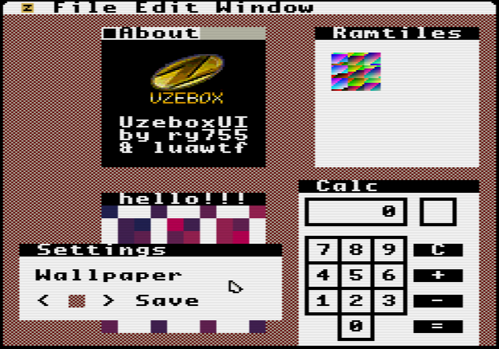

# UzeboxUI

A simple GUI for Uzebox inspired by the original Macintosh System Software

### Note: this software is buggy/unfinished and is not currently being worked on; the code is in dire need of cleanup.

## Features
- External application support with [EmbedVM by Clarie Xen](http://www.clifford.at/embedvm/), a very unfinished (and very poorly designed) API is provided for creating small UzeboxUI applications
- Dynamic "Apps" submenu loaded and parsed from a text file on the SD card
- Dynamic splash screen loaded on startup from a raw image file on the SD card
- Customizable wallpaper tile (theoretically it should be possible to use a ramtile for this to have a user-designed tile, but this is not currently implemented)

## Screenshot

## Authors
Made by ry755/ryfox with help from [luavixen](https://github.com/luavixen), thanks for helping and keeping me motivated ❤
