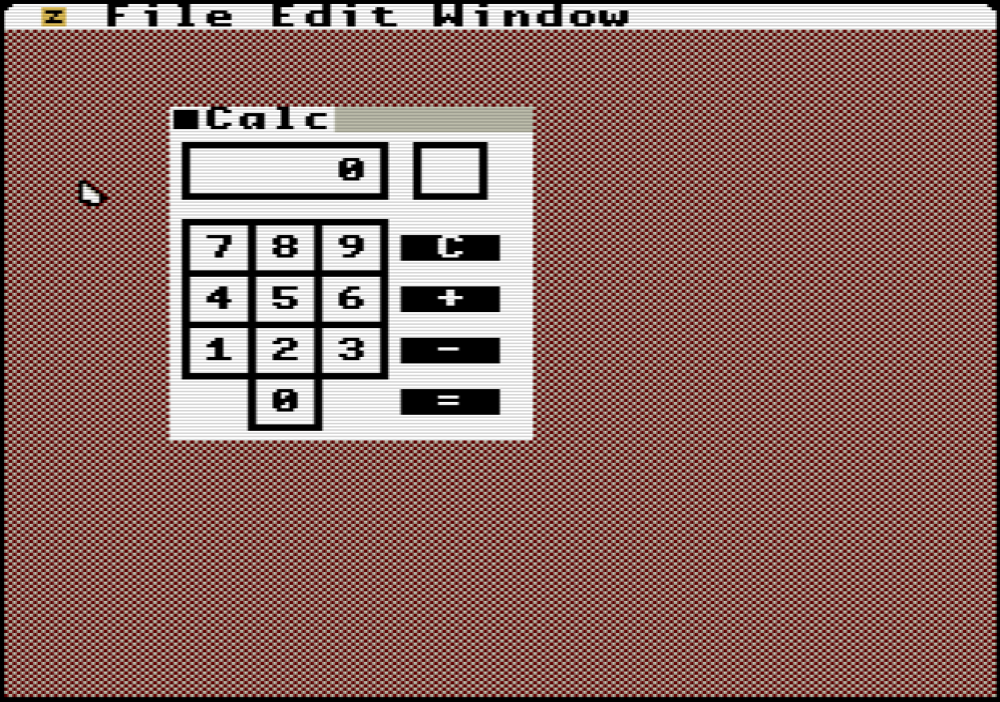

# calc

This is a simple calculator app. It's not very fast, but it gets the job done.

Compile the app using the build.sh script, then copy calc.bin to the same directory as the UzeboxUI.uze file

