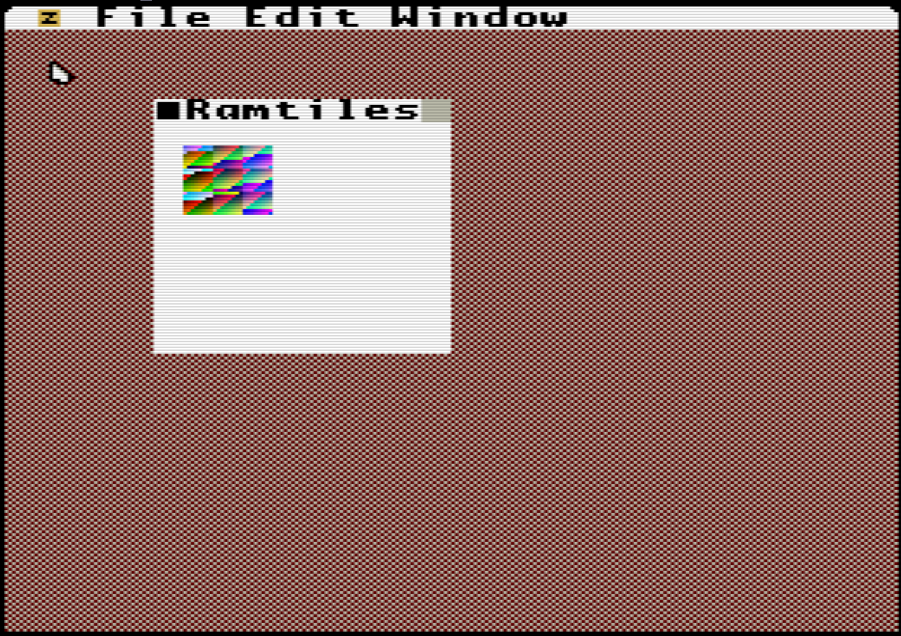

# ramtiles

This demo shows how ramtiles can be used. Note: they are currently very slooooooow

Compile the demo using the build.sh script, then copy ramtiles.bin to the same directory as the UzeboxUI.uze file

